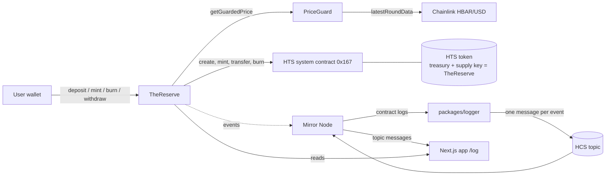

# The Reserve

**A token that can't be minted beyond its reserves, and can't be fooled by a bad price.**

The Reserve is a [Scaffold-HBAR](https://docs.hedera.com/solutions/tools/scaffold-hbar) template for issuing a USD-denominated token on Hedera that is backed by HBAR held on-chain. Users lock HBAR in a contract. Chainlink's HBAR/USD feed values it. The contract mints a Hedera Token Service (HTS) token only while the user's collateral stays above a set ratio (150% by default), and it refuses any price that is stale, malformed, or jumps too far. Every deposit, mint, refusal, burn and withdrawal is posted to a Hedera Consensus Service (HCS) topic, so anyone can audit it on HashScan.

Start from it when you need a backed token, a collateralised stablecoin, or any contract whose supply must follow an oracle-valued reserve.

- [Why it exists](#why-it-exists)
- [Quick start](#quick-start)
- [Prerequisites](#prerequisites)
- [Run it locally](#run-it-locally)
- [Deploy to testnet](#deploy-to-testnet)
- [Environment variables](#environment-variables)
- [Architecture](#architecture)
- [How the reserve rule works](#how-the-reserve-rule-works)
- [How the price guard works](#how-the-price-guard-works)
- [Reason codes](#reason-codes)
- [The audit log](#the-audit-log)
- [Hedera gotchas](#hedera-gotchas)
- [Tests](#tests)
- [Testnet proof](#testnet-proof)
- [Upgrade path: Proof of Reserve](#upgrade-path-proof-of-reserve)
- [Limits](#limits)
- [Extending the template](#extending-the-template)
- [Licence](#licence)

## Why it exists

Issuing a backed token safely takes two things: supply must never outgrow what backs it, and the price used to value the backing must be trustworthy. The second one is where protocols get hurt. On 11 July 2026 Bonzo Lend on Hedera lost about $9.05M after its oracle provider's verifier accepted a manipulated price update that inflated SAUCE by about twelve orders of magnitude ([Cointelegraph](https://cointelegraph.com/news/bonzo-lend-9m-oracle-exploit-hedera), [The Defiant](https://thedefiant.io/news/hacks/bonzo-lend-loses-9m-on-hedera-in-supra-oracle-exploit)). The Reserve puts a guard between the oracle and the mint, so a price like that is refused instead of used.

The built-in **Oracles** template shows how to read a price. The Reserve uses the price to **control token supply**, with the guard and the audit trail a real issuer needs.

## Quick start

```bash
npm create scaffold-hbar@latest -- --template Datwebguy/thereserve
```

Keep the `--`: it passes `--template` through npm to the scaffold tool. Without it npm treats `--template` as its own option and the tool never sees it. `npx create-scaffold-hbar@latest --template Datwebguy/thereserve` is equivalent. The CLI uses Hardhat and Next.js for this template and asks for a package manager (Yarn by default, npm also works). Then:

```bash
cd my-hedera-dapp     # or the name you chose
yarn hardhat:test     # 57 contract tests, offline
yarn hardhat:chain    # terminal 1: local node forking Hedera testnet
yarn deploy --network localhost   # terminal 2
yarn start            # terminal 3: http://localhost:3000
```

With npm, use `npm run <script>` in place of `yarn <script>` (the CLI rewrites the scripts for you).

## Prerequisites

- **Node.js 20.18.3 or later**
- **Yarn** (`corepack enable`) or npm
- **Git**
- For testnet: a **Hedera testnet ECDSA account**. Create one at [portal.hedera.com](https://portal.hedera.com) and fund it from the [faucet](https://portal.hedera.com/faucet). ECDSA (not ED25519) is required because deploys and wallet calls go through the JSON-RPC relay.

## Run it locally

The local node forks Hedera testnet, so the real Chainlink HBAR/USD feed is readable, and Hedera's [`system-contracts-forking`](https://github.com/hashgraph/hedera-forking) plugin emulates the HTS system contract at `0x167`.

```bash
yarn hardhat:chain                    # terminal 1
yarn deploy --network localhost       # terminal 2: deploys PriceGuard and TheReserve, creates the token
yarn hardhat:demo --network localhost # optional: deposit, a mint, and a refused mint
yarn start                            # terminal 3
```

Open http://localhost:3000. The app's burner wallet works on the local chain; use the HBAR faucet button at the bottom left to fund it. On the local fork the emulator does not model token association, so the vault skips that step there.

| Page | What it shows |
|---|---|
| `/` | Reserve summary: HBAR held, its USD value, tokens issued, overall ratio, last accepted price and its age, and whether the guard currently accepts the feed |
| `/vault` | Your collateral, debt, ratio and how much you can mint. Associate, deposit, mint, burn, withdraw. Each result shows what happened, including refusals with their reason code, and a HashScan link on Hedera networks |
| `/log` | The HCS audit topic read from the Mirror Node, newest first |
| `/guard` | Price guard simulator. Enter a price, its age and a previous price; the deployed guard says whether it would accept it. **Labelled as a simulation; it never shows made-up prices as live** |
| `/api/health` | `{"status":"ok"}` |
| `/debug` | Scaffold-HBAR's contract debugger |

## Deploy to testnet

```bash
yarn hardhat:account:import            # paste your testnet ECDSA private key; it is stored encrypted
yarn deploy --network hederaTestnet    # deploys, binds the guard, creates the HTS token
yarn hardhat:demo --network hederaTestnet
```

`deploy` prints HashScan links for the contracts, the token creation and the token. The demo associates the token if needed, deposits 100 HBAR, mints half of what the ratio allows, then asks for three times the limit, which is refused with reason code 1. It prints a HashScan link for each transaction and saves them to `packages/hardhat/deployments/hederaTestnet/demo-proof.json`.

Then start the audit log and point the frontend at its topic:

```bash
cp packages/logger/.env.example packages/logger/.env   # fill in RESERVE_CONTRACT and the logger account
yarn logger                                            # first run creates the topic and prints its ID
echo "NEXT_PUBLIC_HCS_TOPIC_ID=0.0.xxxxx" >> packages/nextjs/.env.local
yarn start
```

The logger reads from the start of the contract's history, so it also posts events that happened before it was started.

## Environment variables

Each package reads its own `.env` file. Only `.env.example` files are committed.

**`packages/hardhat/.env`**

| Name | Purpose | Example | Where to get it |
|---|---|---|---|
| `DEPLOYER_PRIVATE_KEY_ENCRYPTED` | Deployer key, encrypted | (written for you) | `yarn hardhat:account:import` |
| `HEDERA_RPC_URL` | JSON-RPC relay used for forking | `https://testnet.hashio.io/api` | Default works |
| `CHAINLINK_HBAR_USD_FEED` | Override the feed address | `0x59bC…2B4a` | Defaults per network, see below |
| `GUARD_MAX_STALENESS` | Oldest price accepted, seconds | `90000` | Feed heartbeat + margin |
| `GUARD_MAX_JUMP_BPS` | Largest move from last accepted price | `2000` (20%) | Your risk choice |
| `MIN_RATIO_BPS` | Minimum collateral ratio (≥ 11000) | `15000` (150%) | Your risk choice |
| `TOKEN_NAME`, `TOKEN_SYMBOL` | HTS token metadata | `Reserve USD`, `rUSD` | Your choice |
| `TOKEN_CREATE_HBAR` | HBAR for the token creation fee; unused HBAR is refunded | `20` | |
| `DEMO_DEPOSIT_HBAR` | Deposit used by `hardhat:demo` | `100` | |

**`packages/logger/.env`**

| Name | Purpose | Example | Where to get it |
|---|---|---|---|
| `HEDERA_NETWORK` | `testnet` or `mainnet` | `testnet` | |
| `RESERVE_CONTRACT` | The Reserve, `0.0.x` or EVM address | `0x737b…0269` | Printed by `yarn deploy` |
| `LOGGER_OPERATOR_ID` | The logger's own account | `0.0.12345` | [portal.hedera.com](https://portal.hedera.com) |
| `LOGGER_OPERATOR_KEY` | Its private key (DER or hex) | `302e…` | Same |
| `HCS_TOPIC_ID` | Topic to post to; empty creates one | `0.0.67890` | Printed by the first `yarn logger` |
| `MIRROR_NODE_URL` | Mirror Node override | `https://testnet.mirrornode.hedera.com` | Default works |
| `POLL_INTERVAL_MS` | How often to poll | `10000` | |
| `LOGGER_STATE_FILE` | Where progress is saved | `.logger-state.json` | |

Use a separate, lightly funded account for the logger. Its key becomes the topic's submit key, so it can only post to the topic; it never holds or moves reserve funds.

**`packages/nextjs/.env.local`**

| Name | Purpose | Example |
|---|---|---|
| `NEXT_PUBLIC_HCS_TOPIC_ID` | Topic shown on `/log` | `0.0.67890` |
| `NEXT_PUBLIC_HCS_NETWORK` | Network the topic is on | `testnet` |
| `NEXT_PUBLIC_WALLET_CONNECT_PROJECT_ID` | WalletConnect project | from [cloud.reown.com](https://cloud.reown.com) |
| `NEXT_PUBLIC_HEDERA_TESTNET_RPC_URL` | RPC override | `https://testnet.hashio.io/api` |

**Chainlink HBAR/USD feeds** ([directory](https://docs.chain.link/data-feeds/price-feeds/addresses?network=hedera)):

| Network | Proxy | Decimals | Heartbeat | Deviation |
|---|---|---|---|---|
| Testnet | `0x59bC155EB6c6C415fE43255aF66EcF0523c92B4a` | 8 | 24 h | 0.5% |
| Mainnet | `0xAF685FB45C12b92b5054ccb9313e135525F9b5d5` | 8 | 24 h | 0.5% |

The testnet feed was read on-chain on 2 Oct 2026: 8 decimals, answer $0.1053, updated 13 minutes earlier. The fork tests read it again on every run.

## Architecture



| Contract | Role |
|---|---|
| [`TheReserve.sol`](packages/hardhat/contracts/TheReserve.sol) | Holds collateral, tracks debt, creates the token, mints, burns, withdraws. Implements `IReserveSource` |
| [`PriceGuard.sol`](packages/hardhat/contracts/PriceGuard.sol) | Reads Chainlink and decides whether to trust the answer. No admin |
| [`ReserveMath.sol`](packages/hardhat/contracts/ReserveMath.sol) | Pure unit and ratio math. Every HBAR and price conversion lives here |
| [`ReasonCodes.sol`](packages/hardhat/contracts/ReasonCodes.sol) | Reason codes shared by events, the logger and the UI |
| [`IReserveSource.sol`](packages/hardhat/contracts/IReserveSource.sol) | What a reserve is worth in USD; the upgrade path to Proof of Reserve |

**Who can mint:** only TheReserve. It creates its token through the HTS system contract with itself as **treasury** and **only supply key**, **no admin key**, and zero initial supply. There is no owner, no admin mint, and no other path to supply. The token is created by the contract rather than by an SDK `TokenCreateTransaction` because the treasury must sign token creation, and a contract cannot sign an SDK transaction.

## How the reserve rule works

A position is healthy while its collateral is worth at least `minRatioBps` of its debt:

```
value  = collateral (tinybars) × price (8 decimals) / 10^10      → USD with 6 decimals
healthy: debt × minRatioBps ≤ value × 10,000
```

**Worked example** at the default 150% and a price of $0.10:

1. Alice deposits 1,500 HBAR. It is worth $150.
2. She can carry at most $150 / 1.5 = **100 rUSD** of debt.
3. `mint(100 rUSD)` succeeds. Her ratio is exactly 150%.
4. `mint(1 more)` is refused with **reason code 1**; nothing is minted and `MintRejected` is emitted.
5. `withdraw(1 HBAR)` is refused with code 1 too: 1,499 HBAR would only cover 99.93 rUSD.
6. She burns 30 rUSD (no price needed). Her debt is 70 and she can now withdraw up to 450 HBAR.

**Why `mint` and `withdraw` return `false` instead of reverting:** a reverted transaction erases its events, so a refused attempt would leave no trace to log. Returning `false` and emitting `MintRejected` or `WithdrawRejected` keeps every refusal on-chain, where the logger posts it to HCS. Wallets therefore report a refused mint as a successful transaction; the vault page decodes the receipt and shows the refusal and its reason.

**Burning never needs a price.** If the guard refuses every price, users can still repay debt. With zero debt, withdrawing needs no price either.

## How the price guard works

`PriceGuard.getGuardedPrice()` reads `latestRoundData()` and runs these checks in order. The first one that fails decides the reason code.

| # | Check | Refused as |
|---|---|---|
| 1 | `answer > 0` | 3 |
| 2 | `updatedAt != 0`, not in the future, `answeredInRound >= roundId`, not older than the last accepted round; the feed call itself must not revert | 3 |
| 3 | `now - updatedAt <= maxStaleness` | 2 |
| 4 | `|answer - lastPrice| <= lastPrice × maxJumpBps`, while the last accepted price is a live reference | 4 |

The jump check compares against the **last accepted price** only while that price is recent, meaning it was published no more than `maxStaleness` before the new answer. Without that, one large real move would lock minting forever. With it, a sudden jump is refused, and if the market really has moved, minting resumes once the old reference expires (at most `maxStaleness` later). Burns are never blocked.

| Parameter | Default | Why |
|---|---|---|
| `maxStaleness` | 90,000 s (25 h) | The feed's 24 h heartbeat plus a 1 h margin |
| `maxJumpBps` | 2,000 (20%) | Far above the feed's 0.5% deviation trigger, far below a manipulation like Bonzo's |
| `minRatioBps` | 15,000 (150%) | Room for HBAR volatility; the contract refuses anything under 110% |

The parameters are fixed at deployment. There is no admin to change them. Only TheReserve (bound once, at deploy) can record an accepted price. Anyone can call `peek()` (what the guard would say now) and `simulate()` (the same rules on hypothetical inputs, used by `/guard`).

## Reason codes

| Code | Meaning | Emitted by |
|---|---|---|
| 0 | Accepted | |
| 1 | Ratio would fall below the minimum | `MintRejected`, `WithdrawRejected` |
| 2 | Price stale | `MintRejected`, `WithdrawRejected`, `PriceRefused` |
| 3 | Price zero or negative, malformed or incomplete round, or feed unreadable | same |
| 4 | Price jumped more than allowed since the last accepted price | same |
| 5 | Reserved: a second price source disagrees. Not enabled in v1 | |
| 6 | Receiver has not associated the token (`TOKEN_NOT_ASSOCIATED_TO_ACCOUNT`) | `MintRejected` |

Defined in [`ReasonCodes.sol`](packages/hardhat/contracts/ReasonCodes.sol) and [`utils/reserve.ts`](packages/nextjs/utils/reserve.ts).

## The audit log

Contracts cannot write to HCS, so [`packages/logger`](packages/logger) does it. It polls the Mirror Node for TheReserve's logs and submits one HCS message per event:

```json
{
  "v": 1,
  "event": "MintRejected",
  "account": "0x7099…79C8",
  "amount": "99000000",
  "unit": "token",
  "reasonCode": 1,
  "price": "10531056",
  "txHash": "0x…",
  "logIndex": 0,
  "consensusTimestamp": "1790000020.000000001",
  "contract": "0.0.5005"
}
```

- **Never posts the same event twice.** Each event is keyed by `txHash:logIndex` and recorded after it is posted.
- **Resumes after a restart** from the last processed consensus timestamp, saved after every message.
- **Survives a crash mid-post.** On start it reads the topic's newest messages and marks any event already there as posted.
- The topic is created with the logger's key as its **submit key** and no admin key, so only the logger can post and nobody can delete it.

One message per state change keeps costs predictable; the logger never posts page views or reads.

## Hedera gotchas

- **HBAR units.** Inside contracts, `msg.value` and balances are **tinybars (8 decimals)**. The JSON-RPC relay and wallets use **weibars (18 decimals)** for `value`. The frontend and scripts send `parseEther(hbar)` on Hedera networks and `parseUnits(hbar, 8)` on a local Hardhat chain, so the contract always sees tinybars. Contract-side conversions live only in `ReserveMath`.
- **Token association.** An account must associate an HTS token before receiving it, or the transfer fails with `TOKEN_NOT_ASSOCIATED_TO_ACCOUNT` (184). The vault checks with HIP-719 `isAssociated()` and offers an **Associate token** button that calls HIP-719 `associate()` on the token address. If a mint's transfer still hits 184, TheReserve burns the just-minted tokens and returns `false` with reason code 6, so supply never exceeds recorded debt.
- **Supply key and treasury.** Both are TheReserve. The token is created from the contract (see [Architecture](#architecture)) because a contract cannot sign an SDK transaction as treasury.
- **System contract response codes.** Every HTS call (`createFungibleToken`, `mintToken`, `transferToken`, `transferFrom`, `burnToken`) returns a response code. TheReserve checks each one and reverts with `HtsCallFailed(code)` on anything but `SUCCESS` (22), apart from 184 on mint, which is handled as above.
- **Burning takes an allowance.** `burn` pulls tokens with the HTS `transferFrom`, so the user first calls ERC-20 `approve(TheReserve, amount)` on the token. The vault does both.
- **Gas limits.** Relay gas estimates for HTS calls can come in low, and Hedera charges at least 80% of the gas limit, so the UI and scripts set explicit limits close to what each call needs.

## Tests

```bash
yarn hardhat:test       # 57 contract tests, offline: mock HTS installed at 0x167
yarn hardhat:test:fork  # 4 tests on a testnet fork: live Chainlink feed, Hedera's HTS emulation
yarn logger:test        # 11 logger tests: format, idempotency, restart, crash recovery, ABI match
```

**HTS in tests.** Plain Hardhat has no HTS system contract. The unit tests install [`MockHTS`](packages/hardhat/contracts/test/MockHTS.sol) at `0x167` with `hardhat_setCode`, so production code keeps calling the real system address. The mock enforces supply-key, association, balance and allowance rules with Hedera's response codes. The fork tests then run the same flow (create, mint, transfer, approve, burn) against Hedera's own [`system-contracts-forking`](https://github.com/hashgraph/hedera-forking) emulation and the live testnet feed.

Covered: unit conversion, ratio and max-mintable edge cases (exactly at the minimum, zero collateral, very large values); every guard check and its boundary; `evaluate` matching `getGuardedPrice`; mint within and above the ratio; mint with each refused price; mint to an unassociated account; burn while every price is refused; withdraw with and without debt; only TheReserve can mint; one-time token creation; the logger's idempotency and restart behaviour; the logger's event definitions against the compiled ABI.

CI ([`.github/workflows/ci.yml`](.github/workflows/ci.yml)) runs install, lint, type-check, tests and build on Node 20.18.3 and 22, plus the fork tests and a deploy-and-demo against a local testnet fork.

## Testnet proof

> Pending. The links below are added after the first testnet deployment with `yarn deploy --network hederaTestnet` and `yarn hardhat:demo --network hederaTestnet`. Nothing here is filled in until it exists on HashScan.

| What | Link |
|---|---|
| PriceGuard deployment | pending |
| TheReserve deployment | pending |
| HTS token (supply key and treasury = TheReserve) | pending |
| Successful mint (`Minted`) | pending |
| Refused mint, ratio too low (`MintRejected`, code 1) | pending |
| HCS topic with both outcomes | pending |

Until then, the same behaviour is shown by the unit tests, the fork tests against live testnet data, and the CI job that deploys to a local testnet fork and runs the demo.

## Upgrade path: Proof of Reserve

Chainlink announced Proof of Reserve on Hedera in December 2024, but its public feed directory lists **no reserve feeds on Hedera mainnet or testnet**, only price feeds. So The Reserve keeps its reserve on-chain, as HBAR, and values it with a price feed that exists.

The reserve check sits behind [`IReserveSource`](packages/hardhat/contracts/IReserveSource.sol):

```solidity
interface IReserveSource {
    function reserveValueUsd(address account) external view returns (uint256);
    function totalReserveValueUsd() external view returns (uint256);
}
```

TheReserve implements it for its HBAR collateral. When a Proof of Reserve feed is published on Hedera, write an adapter that implements `IReserveSource` from that feed (with its own guard: staleness, completeness, jump limit), and gate minting on `totalSupply ≤ totalReserveValueUsd()` for off-chain reserves. Keep the HBAR path as it is.

## Limits

- **No liquidation in v1.** A position below the ratio cannot mint or withdraw until it is topped up or repaid; nobody can seize it.
- **HBAR is the only collateral.**
- **Single price source.** Reason code 5 is reserved for a second source (for example Pyth) but not enabled.
- **Testnet only.** Not deployed to mainnet.
- **Not audited.** Use as a starting point, not as production code.

## Extending the template

- **Another collateral type:** add an `IReserveSource` implementation with its own feed and guard; do not change the HBAR path.
- **A second price source:** extend `PriceGuard` to compare against another feed and refuse with code 5 above `maxDivergenceBps`.
- **Liquidation:** a separate contract that calls TheReserve, with its own tests.
- **Governance over parameters:** deploy a new guard rather than adding an admin; TheReserve never needs one.

See [`AGENTS.md`](AGENTS.md) for the rules coding agents must keep when changing this template.

## Licence

[MIT](LICENCE). Built on [Scaffold-HBAR](https://github.com/buidler-labs/scaffold-hbar).
